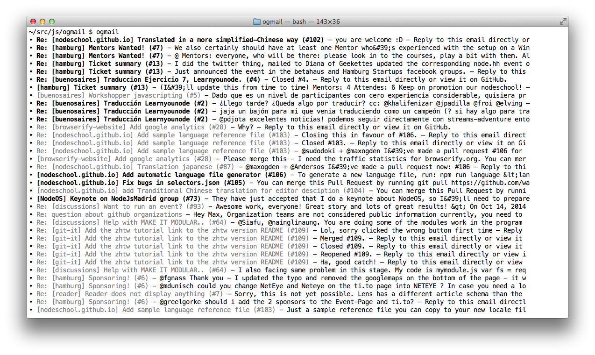

# ogmail

minimalist gmail cli client

**work in progress**



## installation

you will need to install 2 modules globally, `googleauth` and `ogmail`:

```
npm install googleauth ogmail -g
```

next, follow the readme of [`googleauth`](http://npmjs.org/googleauth) to create a google application and get your client, secret and scope

then get a google token using the following command:

```
googleauth --scope=https://www.googleapis.com/auth/gmail.readonly --client_id="foobar" --client_secret="mysecret"
```

this will save your token in `~/.config/googleauth.json` which is also where `ogmail` will look for your token when you use it

finally, run `ogmail` to begin
